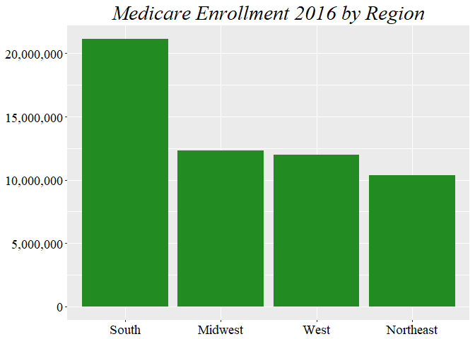

# R_Visualization_Insurance
Monica Perez  
October 26, 2017  


## Medicare and Medicaid Insurance Data from Kaggle 

You can find the data set here: https://www.kaggle.com/hhs/health-insurance/data 

Load to your environment, let's call it insurance


Let's explore the data:


```r
summary(insurance)
```

```
##         State    Uninsured.Rate..2010. Uninsured.Rate..2015.
##  Alabama   : 1   12.4%  : 2            6%     : 3           
##  Alaska    : 1   13.2%  : 2            10.9%  : 2           
##  Arizona   : 1   14.6%  : 2            13.9%  : 2           
##  Arkansas  : 1   15.3%  : 2            3.8%   : 2           
##  California: 1   17.5%  : 2            5.7%   : 2           
##  Colorado  : 1   9.1%   : 2            6.6%   : 2           
##  (Other)   :46   (Other):40            (Other):39           
##  Uninsured.Rate.Change..2010.2015.
##   -4.8% : 4                       
##   -3.8% : 3                       
##   -3.4% : 2                       
##   -4.5% : 2                       
##   -5%   : 2                       
##   -5.8% : 2                       
##  (Other):37                       
##  Health.Insurance.Coverage.Change..2010.2015.
##  Min.   :   15000                            
##  1st Qu.:   97250                            
##  Median :  224500                            
##  Mean   :  747942                            
##  3rd Qu.:  412250                            
##  Max.   :19304000                            
##                                              
##  Employer.Health.Insurance.Coverage..2015.
##  Min.   :   335000                        
##  1st Qu.:   879750                        
##  Median :  2305500                        
##  Mean   :  6626615                        
##  3rd Qu.:  4386500                        
##  Max.   :172292000                        
##                                           
##  Marketplace.Health.Insurance.Coverage..2016.
##  Min.   :   13313                            
##  1st Qu.:   51097                            
##  Median :  130672                            
##  Mean   :  426205                            
##  3rd Qu.:  226082                            
##  Max.   :11081330                            
##                                              
##  Marketplace.Tax.Credits..2016. Average.Monthly.Tax.Credit..2016.
##  Min.   :   1224                $306   : 3                       
##  1st Qu.:  43717                $250   : 2                       
##  Median :  98176                $291   : 2                       
##  Mean   : 361139                $307   : 2                       
##  3rd Qu.: 193684                $178   : 1                       
##  Max.   :9389609                $183   : 1                       
##                                 (Other):41                       
##  State.Medicaid.Expansion..2016. Medicaid.Enrollment..2013.
##       : 1                        Min.   :   67518          
##  False:19                        1st Qu.:  289775          
##  True :32                        Median :  794614          
##                                  Mean   : 2255699          
##                                  3rd Qu.: 1274017          
##                                  Max.   :56392477          
##                                  NA's   :2                 
##  Medicaid.Enrollment..2016. Medicaid.Enrollment.Change..2013.2016.
##  Min.   :   63583           Min.   :   -3935                      
##  1st Qu.:  309113           1st Qu.:   53979                      
##  Median :  978052           Median :  234156                      
##  Mean   : 2828190           Mean   :  644246                      
##  3rd Qu.: 1732724           3rd Qu.:  456249                      
##  Max.   :73532931           Max.   :16106157                      
##                             NA's   :2                             
##  Medicare.Enrollment..2016.
##  Min.   :   88966          
##  1st Qu.:  320887          
##  Median :  818753          
##  Mean   : 2173923          
##  3rd Qu.: 1298255          
##  Max.   :57149984          
## 
```

```r
head(insurance)
```

```
##        State Uninsured.Rate..2010. Uninsured.Rate..2015.
## 1   Alabama                  14.6%                 10.1%
## 2    Alaska                  19.9%                 14.9%
## 3   Arizona                  16.9%                 10.8%
## 4  Arkansas                  17.5%                  9.5%
## 5 California                 18.5%                  8.6%
## 6   Colorado                 15.9%                  8.1%
##   Uninsured.Rate.Change..2010.2015.
## 1                            -4.5% 
## 2                              -5% 
## 3                            -6.1% 
## 4                              -8% 
## 5                            -9.9% 
## 6                            -7.8% 
##   Health.Insurance.Coverage.Change..2010.2015.
## 1                                       215000
## 2                                        36000
## 3                                       410000
## 4                                       234000
## 5                                      3826000
## 6                                       419000
##   Employer.Health.Insurance.Coverage..2015.
## 1                                   2545000
## 2                                    390000
## 3                                   3288000
## 4                                   1365000
## 5                                  19552000
## 6                                   2949000
##   Marketplace.Health.Insurance.Coverage..2016.
## 1                                       165534
## 2                                        17995
## 3                                       179445
## 4                                        63357
## 5                                      1415428
## 6                                       108311
##   Marketplace.Tax.Credits..2016. Average.Monthly.Tax.Credit..2016.
## 1                         152206                             $310 
## 2                          16205                             $750 
## 3                         124346                             $230 
## 4                          56843                             $306 
## 5                        1239893                             $309 
## 6                          67062                             $318 
##   State.Medicaid.Expansion..2016. Medicaid.Enrollment..2013.
## 1                           False                     799176
## 2                            True                     122334
## 3                            True                    1201770
## 4                            True                     556851
## 5                            True                    7755381
## 6                            True                     783420
##   Medicaid.Enrollment..2016. Medicaid.Enrollment.Change..2013.2016.
## 1                     910775                                 111599
## 2                     166625                                  44291
## 3                    1716198                                 514428
## 4                     920194                                 363343
## 5                   11843081                                4087700
## 6                    1375264                                 591844
##   Medicare.Enrollment..2016.
## 1                     989855
## 2                      88966
## 3                    1175624
## 4                     606146
## 5                    5829777
## 6                     820234
```

After loading the data, we can change the column names to make it easier to read and understand.


```r
colnames(insurance) = c("state", "uninsuredRate2010", "uninsuredRate2015",    "uninsuredRateChange2010_2015","healthInsuranceCoverageChange2010_2015", "employerHealthInsuranceCoverage2015", "marketplaceHealthInsuranceCoverage2016", "marketplaceTaxCredits2016","averageMonthlyTaxCredit2016", "stateMedicaidExpansion2016", "medicaidEnrollment2013", "medicaidEnrollment2016", "medicaidEnrollmentChange2013_2016", "medicareEnrollment2016")

head(insurance)
```

```
##        state uninsuredRate2010 uninsuredRate2015
## 1   Alabama              14.6%             10.1%
## 2    Alaska              19.9%             14.9%
## 3   Arizona              16.9%             10.8%
## 4  Arkansas              17.5%              9.5%
## 5 California             18.5%              8.6%
## 6   Colorado             15.9%              8.1%
##   uninsuredRateChange2010_2015 healthInsuranceCoverageChange2010_2015
## 1                       -4.5%                                  215000
## 2                         -5%                                   36000
## 3                       -6.1%                                  410000
## 4                         -8%                                  234000
## 5                       -9.9%                                 3826000
## 6                       -7.8%                                  419000
##   employerHealthInsuranceCoverage2015
## 1                             2545000
## 2                              390000
## 3                             3288000
## 4                             1365000
## 5                            19552000
## 6                             2949000
##   marketplaceHealthInsuranceCoverage2016 marketplaceTaxCredits2016
## 1                                 165534                    152206
## 2                                  17995                     16205
## 3                                 179445                    124346
## 4                                  63357                     56843
## 5                                1415428                   1239893
## 6                                 108311                     67062
##   averageMonthlyTaxCredit2016 stateMedicaidExpansion2016
## 1                       $310                       False
## 2                       $750                        True
## 3                       $230                        True
## 4                       $306                        True
## 5                       $309                        True
## 6                       $318                        True
##   medicaidEnrollment2013 medicaidEnrollment2016
## 1                 799176                 910775
## 2                 122334                 166625
## 3                1201770                1716198
## 4                 556851                 920194
## 5                7755381               11843081
## 6                 783420                1375264
##   medicaidEnrollmentChange2013_2016 medicareEnrollment2016
## 1                            111599                 989855
## 2                             44291                  88966
## 3                            514428                1175624
## 4                            363343                 606146
## 5                           4087700                5829777
## 6                            591844                 820234
```

Now, let's explore the data and see if any of the columns have the appropriate data type.

It seems some values that should have a numeric value have a factor value. Let's change it to numeric and get rid of the '$' that could complicate simple arithmetic for the average monthly tax credit field. I like using gsub() for this task.


```r
insurance$averageMonthlyTaxCredit2016 = as.character(insurance$averageMonthlyTaxCredit2016)
insurance$averageMonthlyTaxCredit2016 = gsub(" ", "", insurance$averageMonthlyTaxCredit2016)
insurance$averageMonthlyTaxCredit2016 = gsub("^.", "", insurance$averageMonthlyTaxCredit2016)
insurance$averageMonthlyTaxCredit2016 = as.integer(insurance$averageMonthlyTaxCredit2016)
```

Now, I'd like to create a region column so that we can compare enrollment between regions in the US. Then, after exploring the data I realized that every state had an extra space at the end, which can easily be removed using gsub() again. 


```r
insurance$regions = NA #to create the new column
insurance$state = as.character(insurance$state) #to edit the state column change to character first
insurance$state = gsub(" $", "", insurance$state) #use gsub to remove the last part of the string by using regex.

head(insurance$regions)
```

```
## [1] NA NA NA NA NA NA
```

Now, we have to poulate our new column. The following for loop takes care of it.


```r
for (i in 1:nrow(insurance)){
  if (insurance$state[i] %in% c("Connecticut", "Maine", "Massachusetts", "New Hampshire", "Rhode Island",
                               "Vermont", "New Jersey", "New York", "Pennsylvania")){
    insurance$regions[i] = "Northeast"
  } else if (insurance$state[i] %in% c("Illinois", "Indiana", "Michigan", "Ohio", "Wisconsin",
                                       "Iowa", "Kansas", "Minnesota", "Missouri", "Nebraska",
                                       "North Dakota", "South Dakota")){
    insurance$regions[i] = "Midwest"
  } else if (insurance$state[i] %in% c("Delaware", "Florida", "Georgia", "Maryland", "North Carolina",
                                       "South Carolina", "Virginia", "District of Columbia", "West Virginia",
                                       "Alabama", "Kentucky", "Mississippi", "Tennessee", "Arkansas",
                                       "Louisiana", "Oklahoma", "Texas")){
    insurance$regions[i] = "South"
  } else if (insurance$state[i] %in% c("Arizona", "Colorado", "Idaho", "Montana", "Nevada", "California",
                                       "New Mexico", "Utah", "Wyoming", "Alaska", "Hawaii", "Oregon",
                                       "Washington")){
    insurance$regions[i] = "West"
  } else {
    insurance$regions[i] = NA
  }
}

head(insurance$regions)
```

```
## [1] "South" "West"  "West"  "South" "West"  "West"
```
Next, I will be using both dplyr and sqldf to run quick queries on the data to have an aggregated data frame. Make sure you install the packages if you haven't already. 


```r
library(dplyr)
```

```r
library(sqldf)
```

I want to know how many were enrolled in both Medicaid and Medicare in 2016 by region, so let's run the following to query it. 


```r
#using dplyr
insuranceTotals2016 = insurance %>%
              group_by(regions) %>%
              summarize(totalMedicare2016 = sum(medicareEnrollment2016), totalMedicaid2016 =   sum(medicaidEnrollment2016))
             
insuranceTotals2016 = na.omit(insuranceTotals2016) #our data has an aggregated last row which included the total amount in the entire US, so it resulted in an NA for the region.

#using sqldf
insuranceTotals2016_sqldf = sqldf('SELECT regions, SUM(medicareEnrollment2016) AS totalMedicare2016,
                                  SUM(medicaidEnrollment2016) AS totalMedicaid2016
                                  FROM insurance 
                                  GROUP BY regions')
```

```r
insuranceTotals2016_sqldf = na.omit(insuranceTotals2016_sqldf)
```

At the end, both results will be the same. Now that we have this data frame, let's plot our results using ggplot2.

#Mapping with ggplot


```r
library(ggplot2)

#Medicare bar chart
g <- ggplot(insuranceTotals2016, aes(reorder(regions,-totalMedicare2016), totalMedicare2016), fill = totalMedicare2016)+ #reorder and the (-) before the totalMedicare tells it to sort in descending order
     geom_bar(position = "dodge", stat = "identity", fill = 'forest green') + 
     scale_y_continuous(labels =  scales::comma) +
     ggtitle("Medicare Enrollment 2016 by Region")+
     theme(plot.title = element_text(family = 'serif' ,color="black", size=22, face="italic", hjust = 0.5))+
     theme(axis.title.x = element_blank())+
     theme(axis.title.y = element_blank())+
     theme(axis.text.x= element_text(family = 'serif' ,color="black", size=14))+
     theme(axis.text.y= element_text(family = 'serif' ,color="black", size=14))

g
```

<!-- -->

Now, let's plot the same for Medicaid.


```r
#Medicaid bar chart

h <- ggplot(insuranceTotals2016, aes(reorder(regions,totalMedicaid2016), totalMedicaid2016), fill = totalMedicaid2016)+
  geom_bar(position = "dodge", stat = "identity", fill = 'navy blue') + 
  scale_y_continuous(labels =  scales::comma) + coord_flip() + 
  #coord_flip changes bars from vertical to horizontal
  ggtitle("Medicaid Enrollment 2016 by Region")+
  theme(plot.title = element_text(family = 'serif' ,color="black", size=22, face="italic", hjust = 0.5))+
  theme(axis.title.x = element_blank())+
  theme(axis.title.y = element_blank())+
  theme(axis.text.x= element_text(family = 'serif' ,color="black", size=14))+
  theme(axis.text.y= element_text(family = 'serif' ,color="black", size=14))

h
```

<!-- -->

As you can see, the South has the most enrollment for both Medicaid and Medicare. 

Important information regarding the syntax of these bar charts:

geom_bar() if you want the heights of the bars to represent values in the data, use stat="identity"

geom_bar() by default x's occurring in the same place with be stacked on top of each other, if you 
want them to be dodged from side to side, use position = "dodge"

theme() is all formatting techniques

uncomment coord_flip() to see your bar chart switch from vertical to horizontal

scale_y_continuous() is to not have scientific notation values

Now, let's use the package reshape2 to reshape our data so that we can compare Medicaid and Medicare side by side. Then, I just renamed the columns to something more understandable.


```r
library(reshape2)

insuranceTotals2016_melt <- melt(insuranceTotals2016)
```

```
## Using regions as id variables
```

```r
names(insuranceTotals2016_melt)[3] <- "totalEnrollment"
names(insuranceTotals2016_melt)[2] <- "insurance"
```

Now that we have the new data frame, we can plot side by side a lot easier.


```r
j = ggplot(insuranceTotals2016_melt, aes(regions, y= totalEnrollment, fill = insurance)) +
      geom_bar(stat="identity", position = "dodge")+
      scale_y_continuous(labels =  scales::comma)+
      ggtitle("Medicare and Medicaid Enrollment 2016 by Region")+
      theme(plot.title = element_text(family = 'serif' ,color="black", size=20, face="italic", hjust = 0.5))+
      theme(axis.title.x = element_blank())+
      theme(axis.title.y = element_blank())+
      theme(axis.text.x= element_text(family = 'serif' ,color="black", size=14))+
      theme(axis.text.y= element_text(family = 'serif' ,color="black", size=14))+
      theme(legend.text = element_text(family = 'serif' ,color="black", size=14))+
      theme(legend.title = element_text(family = 'serif' ,color="black", size=14))+
      scale_fill_manual(values = c("#BE143C", "#3C8A2E")) #just manually choosing colors.

j
```

<!-- -->

The plot shows how both Medicaid and Medicare compare to each other in each region. It's very clear now that the South has the most enrollment in both and that Medicaid is more popular.

We can also create a stacked bar chart to show totals while differentiating between both products.


```r
l = ggplot(insuranceTotals2016_melt, aes(regions, y= totalEnrollment, fill = insurance)) +
      geom_bar(stat="identity", position = "stack")+
      scale_y_continuous(labels =  scales::comma)+
      ggtitle("Medicare and Medicaid Enrollment 2016 by Region")+
      theme(plot.title = element_text(family = 'serif' ,color="black", size=20, face="italic", hjust = 0.5))+
      theme(axis.title.x = element_blank())+
      theme(axis.title.y = element_blank())+
      theme(axis.text.x= element_text(family = 'serif' ,color="black", size=14))+
      theme(axis.text.y= element_text(family = 'serif' ,color="black", size=14))+
      theme(legend.text = element_text(family = 'serif' ,color="black", size=14))+
      theme(legend.title = element_text(family = 'serif' ,color="black", size=14))+
      scale_fill_manual(values = c("#BE143C", "#3C8A2E"))

l
```

<!-- -->

The stacked bars give us a better understanding of totals per region, but the side by side ones help us see which product is more common in each area. 

These charts are cool and everything, but what about mapping this data?


```r
#library(ggmap)

#library(maps)

#library(mapdata)
```

Since we have the state information for each product, we can easily see how enrollment is for each state without need to create 50 bars in a chart. We can just map it.First, let's get some data on the coordinates of each state and plotting it. 


```r
statesMap <- map_data("state") 
head(statesMap)
```

```
##        long      lat group order  region subregion
## 1 -87.46201 30.38968     1     1 alabama      <NA>
## 2 -87.48493 30.37249     1     2 alabama      <NA>
## 3 -87.52503 30.37249     1     3 alabama      <NA>
## 4 -87.53076 30.33239     1     4 alabama      <NA>
## 5 -87.57087 30.32665     1     5 alabama      <NA>
## 6 -87.58806 30.32665     1     6 alabama      <NA>
```

```r
ggplot(data = statesMap) + 
  geom_polygon(aes(x = long, y = lat, fill = region, group = group), color = "white") + 
  coord_fixed(1.3) +
  guides(fill=FALSE) #to remove the legend because 50 different colors would be disturbing for our audience
```

<!-- -->

We have two products, let's choose to map Medicare. First, I will rename the data frame we created with the states' coordinates.


```r
#choosing the data to map

colnames(statesMap) <- c("long", "lat", "group", "order", "state", "subregion")
```

Then, let's select the columns we need from our original data to just plot Medicare 2016 enrollment.


```r
medicare = insurance[, c(1, 14)] #new df with only state and medicare enrollment
medicare$state = tolower(medicare$state) #change to lower case to better join with the states df we had

head(medicare)
```

```
##        state medicareEnrollment2016
## 1    alabama                 989855
## 2     alaska                  88966
## 3    arizona                1175624
## 4   arkansas                 606146
## 5 california                5829777
## 6   colorado                 820234
```

Next, we can join our data of medicare enrollment with that of the states coordinates so we can plot it.

```r
statesMap = statesMap[, c(5, 1, 2, 3, 4, 6)] #reordering columns

medicareStates = inner_join(medicare, statesMap, by = "state")

head(medicareStates)
```

```
##     state medicareEnrollment2016      long      lat group order subregion
## 1 alabama                 989855 -87.46201 30.38968     1     1      <NA>
## 2 alabama                 989855 -87.48493 30.37249     1     2      <NA>
## 3 alabama                 989855 -87.52503 30.37249     1     3      <NA>
## 4 alabama                 989855 -87.53076 30.33239     1     4      <NA>
## 5 alabama                 989855 -87.57087 30.32665     1     5      <NA>
## 6 alabama                 989855 -87.58806 30.32665     1     6      <NA>
```

Now, I can see a problem. Our merged data is reproducing the same enrollment amount for every instance of each state. As you can see, Alabama has multiple instances of the same enrollment number. To fix this, I chose to write a for loop that will compare rows and turn the repeated values to 0 so it doesn't affect our totals when mapping it.


```r
for (i in 1:nrow(medicareStates)){
  if (i < nrow(medicareStates)){
    if (medicareStates$state[i] == medicareStates$state[i+1]){
      medicareStates$medicareEnrollment2016[i] <- medicareStates$medicareEnrollment2016[i]
      medicareStates$medicareEnrollment2016[i+1] <- 0
    }
  } 
}

head(medicareStates)
```

```
##     state medicareEnrollment2016      long      lat group order subregion
## 1 alabama                 989855 -87.46201 30.38968     1     1      <NA>
## 2 alabama                      0 -87.48493 30.37249     1     2      <NA>
## 3 alabama                      0 -87.52503 30.37249     1     3      <NA>
## 4 alabama                      0 -87.53076 30.33239     1     4      <NA>
## 5 alabama                      0 -87.57087 30.32665     1     5      <NA>
## 6 alabama                      0 -87.58806 30.32665     1     6      <NA>
```

FIXED!

Next, we can create a map based on the information we currently have.


```r
medicare_Map = ggplot(data = medicareStates, mapping = aes(x = long, y = lat, group = group)) + 
  coord_fixed(1.3) + 
  geom_polygon(color = "black", fill = "gray")

medicare_Map
```

<!-- -->

Now that we have the map, let's fill it with the actual information we want to map.

For aesthetics, I chose to remove all the axes that we can have in this map like lat and long and their actual values.


```r
remove_axes <- theme(
                  axis.text = element_blank(),
                  axis.line = element_blank(),
                  axis.ticks = element_blank(),
                  panel.border = element_blank(),
                  panel.grid = element_blank(),
                  axis.title = element_blank())
```

Now let's map it!


```r
gradient_map <- medicare_Map + 
  geom_polygon(data = medicareStates, aes(fill = medicareEnrollment2016), color = "white") +
  geom_polygon(color = "black", fill = NA) +
  theme_bw() +
  remove_axes

gradient_map
```

<!-- -->

We had a very nice map but the legend is in scientific notation and some colors within the map seem very similar and hard to identify. Let's fix this.


```r
finalMap = gradient_map + #using the map from above 
  scale_fill_gradientn(colours= c("lightblue", "navyblue"), labels = scales::comma,
                                name = "Population Density")+ #adding manual colors, no scientific notation and legend title
  ggtitle("Medicare Population 2016 in the US")+ #map title
  theme(legend.title = element_text(family = 'serif' ,color="black", size=14))+ #format legend title
  theme(plot.title = element_text(family = 'serif' ,color="black", size=22, face="italic", hjust = 0.5)) #format map title

finalMap
```

<!-- -->

And voila! We got a nicer looking map!
